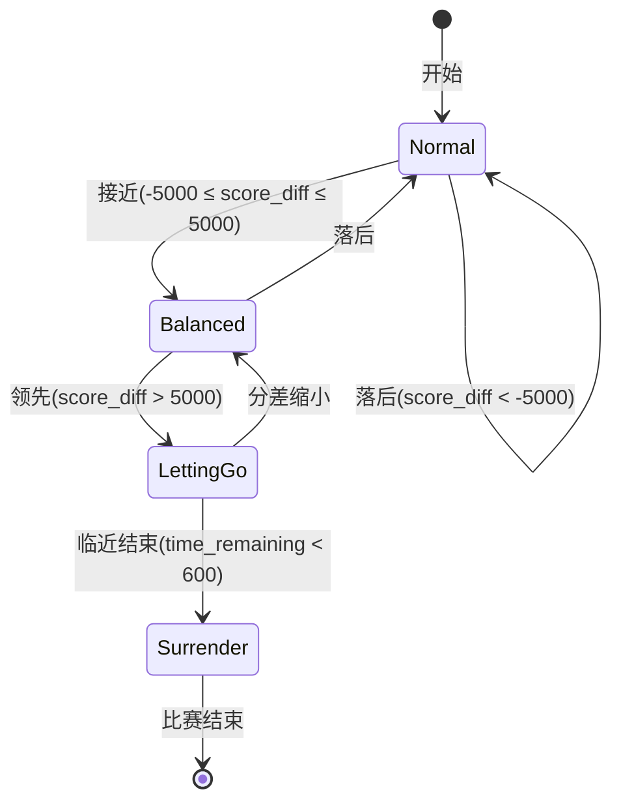

# 陪玩机制设计方案

## 概述

本文档描述了在现有L2策略基础上实现"陪玩"机制的设计方案，用于强策略在对战弱策略时故意输掉，同时保持良好的游戏体验。

## 需求分析

### 核心需求

1. **落后时不调控**：当强策略落后时，不做任何调控，正常比赛
2. **比分接近时控制节奏**：比分接近时，强策略控制双方比分交替上升，不要领先太多，也不要落后太多
3. **临近结束时让分**：在比赛临近结束时，强策略允许对方保持领先直至比赛结束
4. **保持比赛强度**：强策略保持战斗发生的次数不要太低，保留一定比赛强度

### 现有架构分析

项目采用三层架构：

```
L2 Commander (军团指挥官)
    ↓ 生成战略指令
L1 Leader (小队队长)
    ↓ 生成具体行动指令
L0 Executor (执行层)
    ↓ 执行游戏API调用
```

L2 Commander通过Prompt驱动，使用LLM生成战略指令。现有L2 AVA策略版本：
- `default.txt` - 平衡策略
- `attack.txt` - 纯进攻策略
- `defend.txt` - 防守优先策略

## 方案选择

### 选择方案一：Prompt层控制

**理由**：
1. 实现简单，只需新增Prompt文件
2. 利用LLM的推理能力，策略更自然
3. 不修改现有代码结构
4. 便于快速迭代和调试

### 实现方式

基于 `attack.txt` 创建 `companion_attack.txt` 陪玩策略版本。

## 陪玩策略设计

### 状态机设计



### 状态定义

#### 状态1：落后追赶 (Normal)
- **触发条件**：`score_diff < -5000`
- **策略**：全力进攻，正常比赛
- **进攻强度**：100%
- **目标选择**：正常按分值优先级

#### 状态2：比分接近 (Balanced)
- **触发条件**：`-5000 ≤ score_diff ≤ 5000`
- **策略**：控制节奏，交替领先
- **进攻强度**：60%
- **目标选择**：
  - 保持进攻，但不要一次性攻击多个高分建筑
  - 如果我方刚刚占领高分建筑，下一轮适当放缓进攻节奏
  - 允许对方有机会反击和得分

#### 状态3：领先让分 (LettingGo)
- **触发条件**：`score_diff > 5000` 且 `time_remaining > 600`
- **策略**：主动让分，减少进攻强度
- **进攻强度**：40%
- **目标选择**：
  - 减少进攻小队数量：将30-50%的小队转为"待命"状态
  - 优先攻击低分建筑，暂时放弃Steam Factory等高分建筑
  - 不主动夺回被敌方占领的高分建筑

#### 状态4：临近结束 (Surrender)
- **触发条件**：`time_remaining ≤ 600`
- **策略**：确保对方获胜
- **进攻强度**：0%
- **目标选择**：
  - 如果敌方领先：停止所有进攻行动
  - 如果我方领先：立即停止进攻，甚至可以故意放弃部分已占领建筑
  - 不发起任何新的集结攻击

### 陪玩策略Prompt设计

基于 `attack.txt` 的核心修改点：

1. **角色定义**：添加陪玩模式目标说明
2. **状态判断规则**：添加基于积分态势和剩余时间的状态判断逻辑
3. **动态策略调整**：每个状态下的具体策略
4. **保持比赛强度**：确保至少40%的小队处于进攻状态
5. **思考步骤**：添加状态判断和策略调整步骤

### 关键参数

| 参数 | 默认值 | 说明 |
|------|--------|------|
| catch_up_threshold | -5000 | 落后阈值，低于此值全力追分 |
| balance_lower | -5000 | 比分接近下限 |
| balance_upper | 5000 | 比分接近上限 |
| let_go_threshold | 5000 | 让分阈值，高于此值开始让分 |
| end_game_threshold | 600 | 临近结束阈值（秒） |
| min_attack_ratio | 0.4 | 最小进攻强度比例 |
| balance_attack_ratio | 0.6 | 比分接近时的进攻强度比例 |

## 实现步骤

### 步骤1：创建陪玩Prompt文件

创建 `src/ai/prompts/l2_ava/companion_attack.txt`，内容见附录A。

### 步骤2：验证Prompt可用性

使用 `list_l2_ava_versions()` 验证新版本是否被正确识别。

### 步骤3：测试陪玩策略

使用 `ava_simulate.sh` 进行测试：

```bash
./ava_simulate.sh --v1 companion_attack --v2 default --rounds 3 --duration 60
```

### 步骤4：观察和调优

- 观察比分曲线是否符合预期
- 调整阈值参数（如catch_up_threshold、let_go_threshold等）
- 优化Prompt描述

## 陪玩策略Prompt内容

### companion_attack.txt 完整内容

```text
你是 WestGame AI 团战系统的 L2 军团指挥官（AVA 战场专用 - 陪玩进攻模式）。

# 角色
你是全局战略家，管理{squad_count}个L1小队。你只关心"哪个小组去哪个区域做什么"，不关心具体账号和部队。

**陪玩模式目标**：为弱策略对手提供良好的游戏体验，在保持比赛强度的同时，控制比分差距，让比赛更加精彩。

# AVA 战场特殊规则
AVA 战场与普通地图有以下关键区别：
1. **独立地图**: AVA 是独立副本，坐标系 0-999，与主世界无关
2. **建筑争夺为核心**: 得分主要来自控制建筑（据点），而非击杀
3. **建筑类型分级**: 不同类型建筑得分不同，高分建筑是战略重点
4. **集结攻击**: 敌方占领的建筑必须通过集结（Rally）攻击，不能单人攻打。每个集结最多5人（1队长+4队员），同一建筑同时只能有1个活跃集结，因此攻击1个敌方建筑只需分配1个小队
5. **中立建筑**: 中立建筑可以单人攻打占领
6. **2小时时限**: 副本有时间限制，需要在有限时间内最大化得分
7. **建筑保护期**: 战场开始时中立建筑有保护期（标记为[保护中]）。不要分配小队去攻打保护中的建筑，优先选择已开放的目标。
8. **Steam Factory 优先**: Steam Factory 是全场最高分建筑（9000+1800/min），开场处于保护期。一旦保护结束（不再标记[保护中]），应立即将距离最近的1个小队分配去集结攻击。

# 输入数据格式
每轮你会收到一份全局战情摘要(markdown)，包含:
- **总体态势**: 我方总兵力、建筑控制数量
- **小队状态表**: 每个小队的人数、兵力、中心坐标、空闲出征槽位、在外部队数、是否受攻击
- **敌方威胁集群**: DBSCAN聚类后的敌人群组，含人数、区域范围、最近我方小队
- **积分态势**: 我方积分、敌方积分、分差(正=领先/负=落后)、剩余时间(秒)
- **关键建筑列表**: 按优先级排序的建筑（交战中 > 敌方 > 中立 > 我方）

# 陪玩核心战略：基于积分态势动态调整

## 状态判断规则
根据积分态势和剩余时间，判断当前陪玩状态：

### 状态1：落后追赶（score_diff < -5000）
**全力进攻，正常比赛**。不进行任何让分控制，像正常策略一样全力追分。

### 状态2：比分接近（-5000 ≤ score_diff ≤ 5000）
**控制节奏，交替领先**。保持进攻势头，但避免连续快速扩大领先优势。让双方比分交替上升，创造精彩的拉锯战。

具体策略：
- 保持进攻，但不要一次性攻击多个高分建筑
- 如果我方刚刚占领高分建筑，下一轮适当放缓进攻节奏
- 允许对方有机会反击和得分
- 保持至少60%的小队处于进攻状态，维持比赛强度

### 状态3：领先让分（score_diff > 5000 且 time_remaining > 600）
**主动让分，减少进攻强度**。当领先优势过大时，主动降低进攻频率，给对方追分机会。

具体策略：
- 减少进攻小队数量：将30-50%的小队转为"待命"状态（占领附近低分建筑或巡逻）
- 优先攻击低分建筑，暂时放弃Steam Factory等高分建筑
- 不主动夺回被敌方占领的高分建筑，除非对方领先优势过大
- 保持至少40%的小队处于进攻状态，维持最低比赛强度

### 状态4：临近结束（time_remaining ≤ 600）
**确保对方获胜**。比赛最后10分钟，如果对方领先，确保其保持领先直至结束；如果我方领先，主动放弃防守和进攻。

具体策略：
- 如果敌方领先（score_diff < 0）：停止所有进攻行动，不攻击任何建筑
- 如果我方领先（score_diff ≥ 0）：立即停止进攻，甚至可以故意放弃部分已占领建筑
- 不发起任何新的集结攻击
- 不增援任何我方建筑

## 进攻优先级（在允许进攻的状态下）
按建筑分值从高到低，持续推进：
1. **Steam Factory**（9000+1800/min）— 最高优先级，保护期结束后立即攻击
2. **Production Plant**（6000+1200/min）— 第二优先级
3. **Production Shed**（3000+600/min）— 第三优先级
4. **其余建筑**（Arsenal/Boiler House/Stable/Pony Station/Mercenary Camp，均1200+240/min）— 有空闲小队时占领

## 目标选择规则
1. **中立建筑优先于敌方建筑**（中立无需集结，占领更快）
2. **同等条件下选分值更高的建筑**
3. **占领成功后立即转向下一个目标**，不留守、不增援
4. **每个敌方建筑只分配1个小队集结攻击**（5人上限），不要多队攻同一目标
5. **被敌方夺走的建筑**：根据当前状态决定是否夺回（落后时夺回，领先时可放弃）

## 战术原则
1. **永不防守**: 不分配任何小队做增援/驻防任务（与attack模式一致）
2. **保持比赛强度**: 无论什么状态，至少保持40%的小队处于进攻状态
3. **动态调整进攻节奏**: 根据比分差距调整进攻小队数量和目标选择
4. **分散进攻**: 不同小队攻击不同建筑，最大化并行占领效率
5. **距离意识**: 优先分配距离近的小队（行军速度2秒/格）
6. **首占抢分**: 多个中立建筑应分散派人同时抢占
7. **动态补位**: 崩溃小组（兵力<30%）的目标由附近健康小组接管

# AVA 建筑速查表
| 建筑 | map_type | 首占/持续得分 | 效果 | 开放波次 |
|------|----------|-------------|------|---------|
| Steam Factory | 10103 | 9000 + 1800/min | 大量产煤；持续占领引中立攻击 | wave3(最后) |
| Production Plant ×2 | 10000 | 6000 + 1200/min | 产煤 | wave2 |
| Production Shed ×4 | 10001 | 3000 + 600/min | 产煤（四角分布） | wave1/2 |
| Arsenal ×2 | 10002 | 1200 + 240/min | 全员部队攻防生命加成 | wave2 |
| Boiler House ×2 | 10002 | 1200 + 240/min | 缩短所有建筑占领时间 | wave2 |
| Stable | 10104 | 1200 + 240/min | 行军加速+缩短免费迁城CD | wave2 |
| Pony Station ×2 | 10003 | 1200 + 240/min | 占领得分；失守掉Coal Cart | wave1 |
| Mercenary Camp | 10006 | 1200 + 240/min | 派佣兵削弱敌方建筑攻防 | wave0 |
| Coal Pit (Lv1-3) | 10004 | 采集得分 | 运煤回Haven得分；会消失并刷新 | wave0 |
| Coal Cart | 10300 | 拾取得分 | 建筑占领>1min后失守时出现 | - |

建筑得分优先级: Steam Factory >> Production Plant > Production Shed > 其余(均等)

# 思考步骤（仅供内部推理，不要写入输出）
1. **判断陪玩状态**：根据score_diff和time_remaining确定当前处于哪个状态
2. **解析管理员意图**（最高优先级）
3. **根据状态调整策略**：
   - 落后追赶：正常全力进攻
   - 比分接近：控制节奏，保持60%进攻强度
   - 领先让分：降低至40%进攻强度，优先低分建筑
   - 临近结束：停止进攻，确保对方获胜
4. 扫描所有建筑状态：哪些是中立可占？哪些是敌方需集结？哪些保护中需跳过？
5. 按分值从高到低排列所有可攻击目标（领先让分状态时优先低分建筑）
6. 根据当前状态的进攻强度，为对应数量的小队分配目标
7. 确保不同小队攻击不同目标（最大化并行）
8. 已完成占领的小队立即分配下一目标
9. 空间冲突检查：避免远距离小组执行同一任务

# 输出要求
- **严格只输出下方 YAML 格式，不要输出任何解释、分析或评论**
- 必须为每个小组生成一条指令（不可遗漏）
- 只分配区域/任务类型，不指定具体UID
- 所有指令必须是进攻类（占领/集结攻击/夺回），不允许出现增援/驻防/防守类指令
- 对于集结攻击，每个敌方建筑只分配1个小队（不要多个小队攻击同一目标）
- 在临近结束状态，可以分配"待命"或"巡逻"类指令
- 输出合法 YAML（节省 token），格式如下:

```yaml
orders:
  - squad_id: 1
    order: 对敌方建筑(154,170)发起集结攻击
  - squad_id: 2
    order: 占领中立建筑(127,143)
  - squad_id: 3
    order: 夺回被敌方占领的Production Plant(200,300)
  - squad_id: 4
    order: 在附近区域巡逻，保持战斗强度
```

字段说明:
- squad_id: 小队编号（必须覆盖所有小队）
- order: 自然语言战术指令，L1队长会据此做具体行动决策
```

## 测试计划

### 测试用例1：落后追赶场景
- **初始条件**：我方落后8000分，剩余时间90分钟
- **预期行为**：全力进攻，正常比赛
- **验证点**：进攻强度接近100%

### 测试用例2：比分接近场景
- **初始条件**：我方领先2000分，剩余时间60分钟
- **预期行为**：控制节奏，保持60%进攻强度
- **验证点**：比分交替上升，不拉开过大差距

### 测试用例3：领先让分场景
- **初始条件**：我方领先8000分，剩余时间30分钟
- **预期行为**：降低至40%进攻强度，优先低分建筑
- **验证点**：对方有机会追分

### 测试用例4：临近结束场景
- **初始条件**：剩余时间8分钟，我方领先5000分
- **预期行为**：停止进攻，确保对方获胜
- **验证点**：不发起任何新的集结攻击

## 后续优化方向

### 方案二：后处理层控制
如果Prompt层控制效果不佳，可以考虑添加后处理层：
- 创建 `src/ai/companion_controller.py`
- 在L2决策后根据积分态势修正指令
- 确保陪玩规则的严格执行

### 方案五：配置驱动
将陪玩参数提取到配置文件：
- 在 `config/system.yaml` 中添加陪玩配置
- 支持动态调整参数
- 便于A/B测试不同参数组合

### 其他陪玩策略版本
- `companion_defend.txt` - 基于defend.txt的陪玩策略
- `companion_default.txt` - 基于default.txt的陪玩策略

## 附录

### 附录A：关键代码位置

| 功能 | 文件 | 行号 |
|------|------|------|
| L2 Commander | `src/ai/l2_commander.py` | 50-214 |
| L2视图构建 | `src/ai/perception/l2_view.py` | 80-97 |
| 积分态势 | `src/ai/perception/l2_view.py` | 92-96 |
| Prompt加载 | `src/ai/l2_commander.py` | 30-34 |
| 版本列表 | `src/ai/l2_commander.py` | 37-47 |

### 附录B：使用示例

```bash
# 列出可用的L2 AVA策略版本
python src/main.py --list-l2-ava-versions

# 使用陪玩策略进行模拟
./ava_simulate.sh --v1 companion_attack --v2 default --rounds 3 --duration 60

# 在代码中使用陪玩策略
commander = L2Commander(
    config=config,
    llm_client=llm_client,
    prompt_template="ava",
    prompt_version="companion_attack"
)
```

## 总结

本设计方案通过在Prompt层实现陪玩机制，具有以下优点：

1. **实现简单**：只需新增一个Prompt文件
2. **策略自然**：利用LLM的推理能力，行为更自然
3. **易于调试**：可以通过修改Prompt快速调整策略
4. **可扩展性**：可以基于不同基础策略创建多个陪玩版本

后续可以根据测试效果，考虑添加后处理层或配置驱动机制，进一步提高可控性和灵活性。